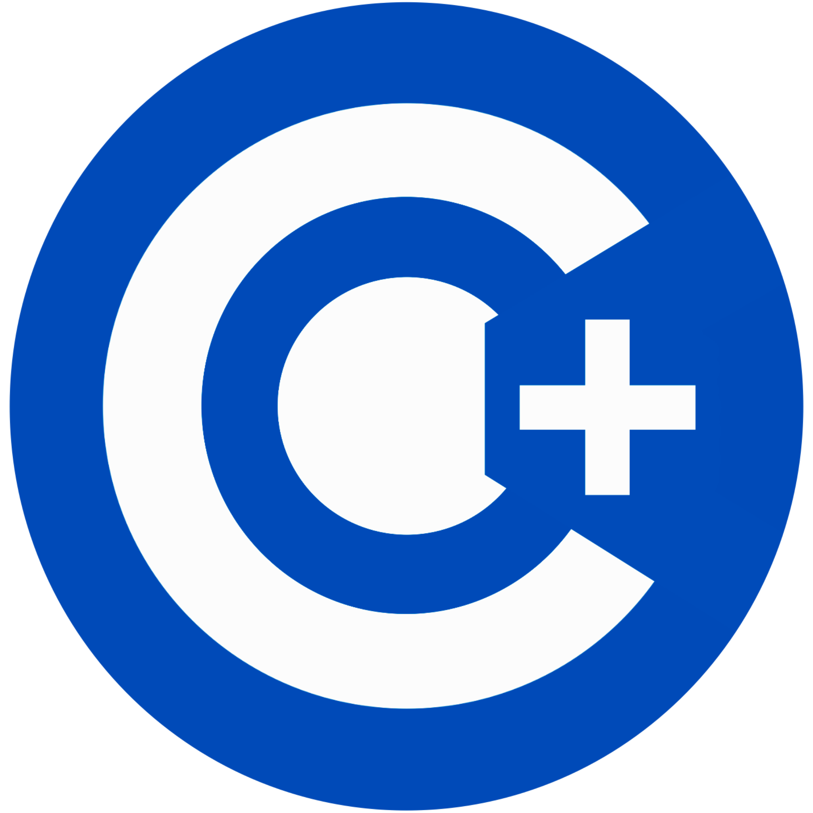

# Codeowners Plus

Code Ownership &amp; Review Assignment Tool - GitHub CODEOWNERS but better

[](https://goreportcard.com/report/github.com/multimediallc/codeowners-plus?kill_cache=1)
[](https://github.com/multimediallc/codeowners-plus/actions/workflows/go.yml)

[](https://opensource.org/licenses/BSD-3-Clause)
[](CODE_OF_CONDUCT.md)



## Table of Contents

- [Overview](#overview)
- [Features](#features)
- [Getting Started](#getting-started)
  - [GitHub Configuration](#github-configuration)
  - [GitHub Teams Support](#github-teams-support)
- [Configuration](#configuration)
  - [.codeowners File Spec](#codeowners-file-spec)
  - [Advanced Configuration](#advanced-configuration)
    - [Enforcement Options](#enforcement-options)
  - [Quiet Mode](#quiet-mode)
- [CLI Tool](#cli-tool)
- [Contributing](#contributing)
- [Future Features](#future-features)

## Overview

This tool is meant to be an alternative to [GitHub CODEOWNERS](https://docs.github.com/en/repositories/managing-your-repositorys-settings-and-features/customizing-your-repository/about-code-owners), overcoming limitations with the `CODEOWNERS` spec and GitHub code owners feature.

### Caveats & Disclaimer

We hope that GitHub integrates some of these ideas into the code owners feature itself.
Unfortunately, because code owners does not involve AI, GitHub will likely not prioritize it.

Because this tool is not built into GitHub itself, it does not get first-party integration like the owners badge next to the reviewer's name.
Instead, this tool uses comments to communicate who the required reviews are, and uses status check as the default way to enforce required reviews.

## Features

These are features missing from GitHub code owners that are supported by Codeowners Plus:

* Smart dismissal of stale reviews (only dismiss review when owned files change, rather than any reviewable push)
* Admin bypass functionality for emergency overrides by repository administrators
* Supports multiple owners of files (`AND` ownership rules)
  * GitHub CODEOWNERS supports only `OR` ownership rules, in contrast
* Directory-level code ownership files to assign fine-grained code ownership
* Supports optional reviewers (cc users/teams for non-blocking reviews)
* Advanced global configuration (see [Advanced Configuration](#advanced-configuration))

## Getting Started

### Basic Setup

Create a `.codeowners` file in the root of your repository with the following contents:

```codeowners
# fallback owner for any file
* @your-username
```

This rule will set up your repo so `@your-username` will become a required approval for any file changed. When you are ready to add more rules, see [.codeowners File Spec](#codeowners-file-spec).

Create a GitHub Actions workflow:

```yaml
name: 'Code Owners'

concurrency:
  group: codeowners-${{ github.ref }}
  cancel-in-progress: true

on:
  pull_request:
    types: [opened, reopened, synchronize, ready_for_review, labeled, unlabeled]

permissions:
  contents: read       # required for @actions/checkout
  issues: write        # required to create comments
  pull-requests: write # required to request reviewers

jobs:
  codeowners:
    name: 'Run Codeowners Plus'
    runs-on: ubuntu-latest
    steps:
      - name: 'Checkout Code Repository'
        uses: actions/checkout@v4
        with:
          fetch-depth: 0

      - name: 'Codeowners Plus'
        uses: multimediallc/codeowners-plus@v1.5.0
        with:
          github-token: '${{ secrets.GITHUB_TOKEN }}'
          pr: '${{ github.event.pull_request.number }}'
          verbose: true
          quiet: ${{ github.event.pull_request.draft }}
```

### GitHub Configuration

The `Codeowners Plus` GitHub Action should be set up as a [required status check](https://docs.github.com/en/repositories/configuring-branches-and-merges-in-your-repository/managing-protected-branches/about-protected-branches#require-status-checks-before-merging) in a GitHub Workflow.

It is recommended to also set up a rerun workflow on `pull_request_review` to rerun the check (see [.github/workflows/rerun_codeowners.yml](.github/workflows/rerun_codeowners.yml) for an example).

**For advanced features to work, such as only re-requesting review when owned files are changed, you must disable this rule in branch protections:**
`Dismiss stale pull request approvals when new commits are pushed`

### GitHub Teams Support

If you plan to have organization teams as code owners, you will need to use a PAT that has organization [read access for Members and Administration](https://docs.github.com/en/rest/authentication/permissions-required-for-fine-grained-personal-access-tokens) as the token. If you do not have organization teams as owners, [GITHUB_TOKEN](https://docs.github.com/en/actions/security-for-github-actions/security-guides/automatic-token-authentication#using-the-github_token-in-a-workflow) should be sufficient.

## Configuration

### .codeowners File Spec

It is recommended to have a `.codeowners` file in each directory.  However, if there is no `.codeowners` file in a directory, Codeowners Plus will still recursively check rules from higher in the directory tree.

To set fallback (default) owners for any file in the directory, use `*`:
```
* @your-org/dir-owner-team
```

To set owners for a specific file in the given directory, use the file name:
```
# matches only one file in this directory with the name `file_name.md`
file_name.md @your-org/file-owner-team
```

To set wildcard rules, use globstar pattern matching:
```
# matches all files in this directory starts with `test` and ends in `.py` - for example `test_one.py`
test*.py @your-org/tests-owner-team
# matches all files in this directory that include `config` in the filename
*config*
# matches all files in this directory or any subdirectory ending in `.js`
**/*.js
# matches all files in any directory called models
**/models/**
# matches any file in a subdirectory that starts with `prefix_`
prefix_*/**

# Note - `**` will be treated like `*` if it is not surrounded by path separators - for example
test**.txt
# will be treated the same as
test*.txt
```
For more details, see [doublestar patterns](https://github.com/bmatcuk/doublestar#patterns).

By default, each file will resolve to a single reviewer.  See [priority section](#priority) for details about how the owner is assigned.

To instead require an owner as an additional reviewer (`AND` rule), put an `&` at the start of the line:
```
# this rule will add `@task-auditor` as a required review in addition to the file owner's required review
& **/task.go @task-auditor
```

You can also add non-owner (view-only / optional) reviewers by putting a `?` at the start of the line:
```
# this rule will cause `@your-org/data-team` to be alerted about the pull request without requiring them to submit a review
? **/migrations/** @your-org/data-team
```
Non-owner reviewers will be pinged in a comment, but not added as reviewers

Any rule can also be an `OR` rule by putting 2 or more teams on the same line:
```
& **/models.py @models-owner-1 @models-owner-2
```
In the above rule, either `@models-owner-1` OR `models-owner-2` can dismiss this additional reviewer rule for `models.py` files

Comments are also suppored:
```
# This is a comment
```

#### Matching differences from Github CODEOWNERS

`.codeowners` rules are always relative to the directory the file lives in, while `CODEOWNERS` are not relative.
For example - `*.js` in `CODEOWNERS` matches any file in the repo that ends in `.js` but in `.codeowners` it will only match files in its directory that end in `.js`.
To match any file that ends in `.js`, use `**/*.js`

Because all rules in a `.codeowners` file are relative to its directory, leading `/` are ignored.  By contrast, `CODEOWNERS` uses leading `/` to target rules from the root of the repository.

`.codeowners` rules do not directly support the `CODEOWNERS` trailing `/` to match any file in a directory (example `apps/` to match any file in an apps directory).
However, the parser will replace trailing `/` with trailing `/**` to indirectly support it.

### Priority

This is the priority of file owners in order from highest priority to lowest priority:

* specific file owner
* wildcard file owner
* globstar file owner
* globstar file owner from parent dirs (recursive)
* fallback owner for dir
* fallback owner from parent dir (recursive)

This means if there is overlap in rules, the last declared will be the owner.  This is similar to GitHub `CODEOWNERS`, except with type-of-rule priority.

### Advanced Configuration

You can include a `codeowners.toml` in the root of your project to add some advanced configuration options.

`codeowners.toml`:
```toml
# `min_reviews` (default nil) allows you to specify the minimum number of reviews required
min_reviews = 1

# `max_reviews` (default nil) allows you to skip some reviewers if the number of reviewers
#  is greater than the max_reviewers
max_reviews = 2

# `unskippable_reviewers` (default empty) allows you to specify reviewers that cannot be
#  skipped via the max_reviews setting
unskippable_reviewers = ["@BakerNet"]

# `ignore` (default empty) allows you to specify directories that should be ignored by the
#  codeowners check
ignore = ["test_project"]

# `high_priority_labels (default empty) will cause "High Prio" label to be added to comments
#  when one of these PR labels is present
high_priority_labels = ["high-priority", "urgent"]

# `detailed_reviewers` (default false) means the codeowners will include a collapsible list 
# of files and owners in its review comment
detailed_reviewers = true

# `disable_smart_dismissal` (default false) means the codeowners will not dismiss stale reviews
disable_smart_dismissal = true

# `enforcement` allows you to specify how the Codeowners Plus check should be enforced
[enforcement]
# see "Enforcement Options" below for more details

# `admin_bypass` allows repository administrators to bypass codeowner requirements
[admin_bypass]
# see "Admin Bypass" below for more details
```

When a PR has any of the `high_priority_labels`, the comment will look like this:
```
❗High Prio❗

Codeowners approval required for this PR:
- @user1
- @user2
```

#### Enforcement Options

In some cases, it may be undesirable to fail the status check - for example if you want to keep the green check reflecting the health of PR code.

To prevent Codeowners Plus check from failing, but instead add an approval to the PR, you can use `enforcement.approval` setting.

Notably, this can be used in conjunction with `CODEOWNERS` if the token owner is a user.

`codeowners.toml`:
```toml
[enforcement]
# `approval` (default false) means the github token owner will approve the PR.
# This can be used alongside GitHub CODEOWNERS to enforce Codeowners Plus checks by making
#  the github token owner the only CODEOWNER
approval = true
# `fail_check` (default true) means the codeowners GHA check will fail if the codeowners check fails
fail_check = false
```

`.github/CODEOWNERS`:
```
# NOTE: This should be the only rule
# github token owner (GitHub user set up to act as a bot)
* @token-owner
```

With this setup, `@token-owner` will be a GitHub code owner on every PR, and Codeowners Plus will approve on behalf of `@token-owner` when all required reviews are satisfied, unblocking merge.

Unfortunately, `CODEOWNERS` does not support apps/bots as owners despite there being an [active discussion requesting the feature since 2020](https://github.com/orgs/community/discussions/23064).
Hopefully GitHub adds support for apps/bots as codeowners so this option can become viable for non-org repos.

#### Admin Bypass

Repository administrators can bypass all codeowner requirements in emergency situations by creating a special approval review containing "Codeowners Bypass" text. This feature:

- **Requires authorization**: Only repository admins or users listed in `admin_bypass.allowed_users` can create valid bypass approvals
- **Guarantee success**: When detected, the PR passes all codeowner checks regardless of missing approvals
- **Audit trail**: Creates a clear record of who bypassed requirements and when

`codeowners.toml`:
```toml
[admin_bypass]
# `enabled` (default false) enables checking reviews for a bypass from repository admins
#   and allowed_users
enabled = true
# `allowed_users` (default empty) includes a list of users who can trigger Admin Bypass
allowed_users = ["emergency-contact", "release-manager"]  # Optional specific users
```

To trigger the admin bypass feature, **Create an approval review containing "Codeowners Bypass" text**. This can be done by:
- Repository administrators manually approving the PR with "Codeowners Bypass" in their review comment
- Users listed in `allowed_users` manually approving with the bypass text
- Automated workflows that create approval reviews with the bypass text on behalf of authorized users

Codeowners Plus automatically detects and validates the bypass approval, immediately marking the PR as passing all codeowner requirements.

The bypass text is case-insensitive, so "codeowners bypass", "Codeowners Bypass", or "CODEOWNERS BYPASS" all work.

### Quiet Mode

Using the `quiet` input on the action will change the behavior in a couple ways:

* **No Comments:** The action will **not** post the review status comment (listing required/unapproved reviewers) or the optional reviewer "cc" comment to the Pull Request.
* **No Review Requests:** The action will **not** automatically request reviews from required owners who have not yet approved via the GitHub API.

#### Use Cases

* **Draft Pull Requests:** This is a common use case. You might want the Codeowners Plus logic to run and report a status (e.g., pending or failed) on draft PRs, but without notifying reviewers prematurely by adding comments or requesting reviews until the PR is marked "Ready for review".
* **Custom Notification Workflows:** You might prefer to handle notifications or review requests through a different mechanism and only use Codeowners Plus for the status check enforcement.

## CLI Tool

A CLI tool is available which provides some utilities for working with `.codeowners` files.

You can download the built tools via [releases](https://github.com/multimediallc/codeowners-plus/releases) or build from source:
```bash
go build -o codeowners-cli ./tools/cli
```

Available subcommands are:

* `unowned` to check for unowned files
* `owner` to check who owns a specific file or list of files
* `validate` to check for typos in a `.codeowners` file

## Contributing

See [CONTRIBUTING.md](https://github.com/multimediallc/codeowners-plus/blob/main/CONTRIBUTING.md)

## Future Features

* Inline ownership comments for having owners for specific functions, classes, etc.
